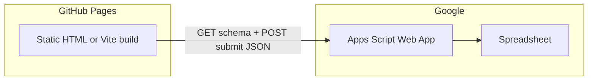

# Survey site: GitHub Pages + Google Sheets + Apps Script

## Locked decisions (from you)

- **Form mapping (1.A):** The `form` query parameter selects a **Google Sheet tab** (exact tab name, or a short slug resolved via a small static mapping in the front-end config if you want prettier URLs than raw tab names).
- **Submit model (2.C):** **MVP = append-only** responses (one row per submission). **Phase 2** can add “update existing row” (e.g. `row=` or opaque `token=` in the URL) without changing the overall architecture.

## Architecture

- **Front-end:** Reads `?form=` from `window.location`, fetches survey definition from Apps Script, renders daisyUI components, POSTs answers.
- **Back-end:** Apps Script bound to (or given ID of) one spreadsheet: reads the tab whose name matches the resolved form id, validates payload, appends to a responses store.

## Spreadsheet conventions (MVP)

Pick one spreadsheet as the system of record.

**Per-survey tab (name = `form` value or mapped tab name)** — two blocks:

1. **Metadata block (fixed cells or a small key/value table)**  
   Example: rows 1–3 with keys in column A and values in B: `FORM_TITLE`, `FORM_SUBTITLE`, `HERO_IMAGE_URL` (your “titles and image url” requirement). Apps Script reads this range first.

2. **Field definition table (starting at a fixed row, e.g. row 5)**  
   Headers such as: `fieldId`, `label`, `type`, `required`, `options` (comma-separated for selects), `placeholder`, `helpText`.  
   `type` supports a small closed set for MVP: `text`, `textarea`, `email`, `number`, `select`, `checkbox` (boolean), optional `radio` if needed.

**Responses storage (append-only MVP)** — separate tab e.g. `AllResponses` with columns:

- `timestamp` (ISO), `form` (tab name), `payload_json` (stringified object `fieldId -> value`)

This avoids dynamic column explosion when forms differ. Phase 2 “update row” can add a stable `response_id` column and matching logic.

## Google Apps Script API (contract)

Deploy as **Web app**: execute as you, access **Anyone** (anonymous surveys). Document the security trade-off (anyone who discovers the URL can POST; mitigate with optional secret token in script properties checked on each request, rate limits are limited in GAS—keep expectations clear).

**Endpoints (single `doGet` / `doPost` URL with `action` query param or path-style):**

| Action | Method | Purpose |
|--------|--------|---------|
| `schema` | GET | `form` query → metadata + fields array as JSON |
| `submit` | POST | JSON body `{ form, answers: { [fieldId]: value } }` → append row |

**Implementation notes:**

- Validate every `fieldId` against the tab’s definition; reject unknown keys and wrong types.
- **CORS:** Before shipping, verify `fetch` from your real GitHub Pages origin to the deployed `script.google.com/.../exec` URL returns readable JSON. If a browser blocks CORS, fallback options to document in the repo: JSONP-style `doGet` with `callback=` for schema only, and for submit use `no-cors` **only** if paired with a server-visible side effect you cannot read (generally avoid)—prefer adjusting deployment or using a thin proxy later. Most teams get `ContentService` JSON working for their domain; plan an explicit smoke test step.

## Front-end (GitHub Pages + daisyUI)

- **Stack:** [Tailwind CSS](https://tailwindcss.com/) + [daisyUI](https://daisyui.com/) (daisyUI is a Tailwind plugin). For a small repo, **Vite** + Tailwind + daisyUI building to `dist/` is easier to maintain than ad-hoc CDN wiring; GitHub Actions can run `npm ci && npm run build` and upload `dist/` to Pages (or push to `gh-pages`).
- **Runtime:** On load, parse `form` from query string; if missing, show a daisyUI **alert** / empty state with instructions.
- **UI:** Hero image (`img` with sensible max height), title/subtitle from schema, then `form` built from field defs using daisyUI `input`, `textarea`, `select`, `toggle`/`checkbox`, `btn` for submit, `toast` or `alert` for errors.
- **Submit:** Disable button + loading state; on success show **success** message (daisyUI `alert` success / modal); optionally clear or keep values per your preference.

**Optional static slug map:** `forms.json` or inline map in `config.ts`: `{ "contact": "Survey_Contact" }` so public URLs use `?form=contact` while the sheet tab stays `Survey_Contact`.

## Repo layout (suggested)

- `src/` — HTML shell, small TS/JS modules: `parseQuery`, `api.ts`, `renderForm.ts`, `main.ts`
- `gas/` or `apps-script/` — `Code.gs` (and `appsscript.json` if using clasp) with documented deploy steps
- [`README.md`](README.md) — how to duplicate the sample sheet, bind script, deploy web app URL, set build-time env `VITE_GAS_BASE_URL` (e.g. GitHub Actions secret of the same name) for the script URL
- **[`PLAN.md`](PLAN.md)** — copy of this plan for version control (you asked for a markdown plan file; add this after plan approval when you leave plan-only mode, or duplicate CreatePlan output into `PLAN.md` in the repo root)

## Phase 2 (row update, from 2.C)

- Add optional query `token=` or `row=` (less safe) validated in GAS.
- `submit` mode `upsert`: if token present, locate row in `AllResponses` or per-form sheet and update instead of append.
- Front-end: single code path with `submitPayload` shape extended; keep append as default when params absent.

## Verification checklist (non-code)

- [ ] Sample sheet created; one tab metadata + fields; `AllResponses` exists with header row  
- [ ] Apps Script deployed; `schema` GET returns expected JSON in browser  
- [ ] `submit` POST appends row with correct `form` and JSON  
- [ ] GitHub Pages URL loads UI; full flow on mobile width  
- [ ] Document limits: no auth, abuse mitigation expectations, and not for highly sensitive PII without additional controls  

## Open defaults (no blocker)

- Exact row/column layout for metadata can be adjusted in one place in GAS as long as the contract stays stable for the front-end.
- Workspace path may be unset in the IDE; when you open the repo again, scaffold files under your `survey` project root as above.
